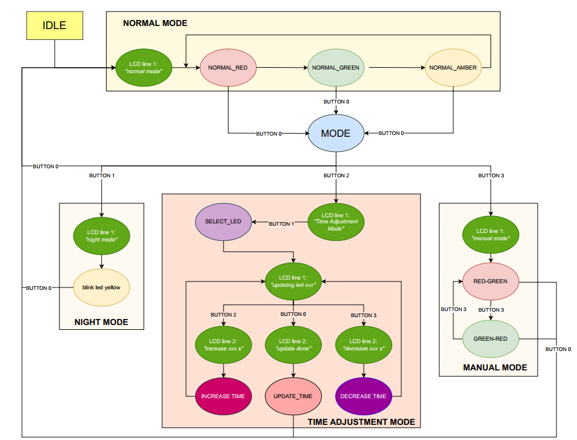

# CO3009: MICROPROCESSOR & MICROCONTROLLER 

**HK241: TRAFFIC LIGHT FULL-MODE WITH STM32 AND ESP32**

## OVERVIEW
Nowadays, along with the development of science and technology, society is becoming increasingly civilized and modern, and urban development is on the rise. The demand for transportation has become increasingly urgent, especially in urban areas. Due to the necessities of human life, particularly the need for mobility, the number of vehicles has surged dramatically. In Vietnam alone, the number of motorcycles has skyrocketed in recent years, resulting in a higher density of vehicles on the roads. However, Vietnam’s road infrastructure still has many limitations, often leading to issues such as traffic congestion, gridlocks, and an increasing prevalence of traffic accidents, which pose a significant threat to many people.

For this reason, traffic laws have been introduced and strictly enforced, gradually becoming widespread as we see today. Among these measures, the traffic light system serves as a practical and effective tool for regulating public traffic. It plays a crucial role in ensuring safety and reducing traffic accidents. 

In our group's project, we simulate a traffic light with four main functions, including: normal operation, time adjustment, night mode, and manual control.

## MEMBER
|    NAME       |
| -------- |
|DƯƠNG MINH HIẾU|
|NGUYỄN NGỌC HÀ MY|
|TRỊNH THỊ MỸ LỆ|
## HARDWARE
Board: nucleo-STM32F103RB, ESP32 NodeMCU LuaNode32

## SOFTWARE
STM32CubeIDE, Arduino IDE

## FINATE STATE MACHINE

